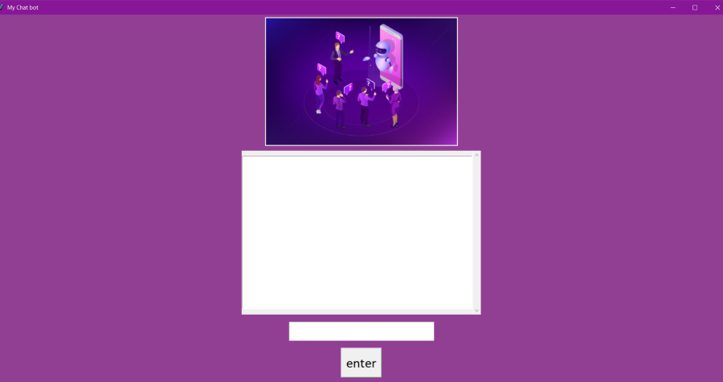
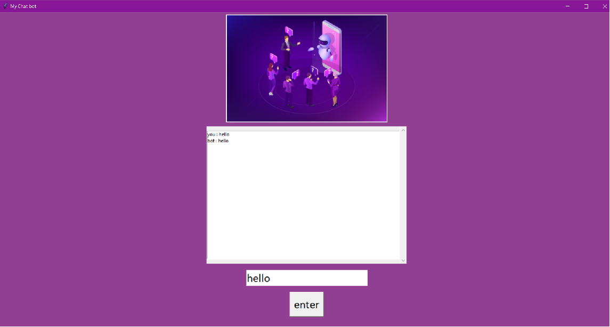
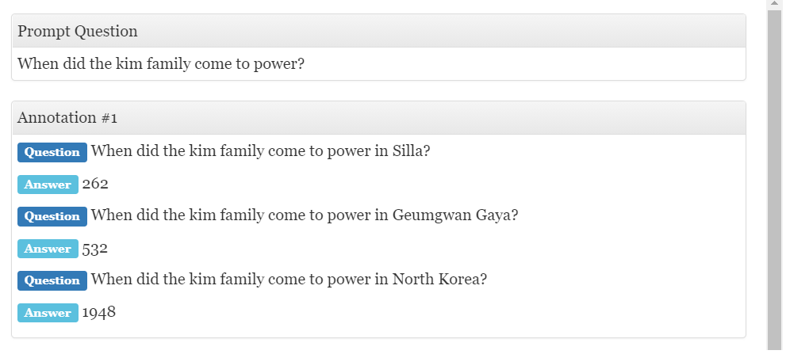

# Speech Recognition Chat Bot
Through chatbots one can communicate with a text or voice interface and get the reply. Typically, a chat bot will communicate with a real person. Chat bots are used in applications such as ecommerce customer service, call centres and Internet gaming. Chatbots are programs built to automatically engage with received messages.

# Overview
My project is a speech recognition chatbot with simple user interface. Chatbots are programs built to automatically engage with received messages. Here the chatbot is designed in such a way that it recognizes the speech and replies to it. The objective is it should recognize the speech clearly, and it should also reply correspondingly in text and audio. Chatbots are a class of intelligent, conversational systems that works by natural language input that can be in the form of text, voice, or both. They provide conversational output in response and are sometimes used for task execution. The Bot uses an offline backend corpus as a knowledge base. User initializing verbal input via a microphone. Then convert the answer into Voice output.

For user interface tkinter, pillow module is used. Tkinter opens another window called root or main. Pillow supports a wide variety of images such as “jpeg”, “png”, “bmp”, “gif”, “ppm”, “tiff”. The ImageTk module contains support to create and modify Tkinter BitmapImage and PhotoImage objects from PIL images. Tkinter contains font, messagebox, scroll-text, config, buttons and many methods to create a good GUI.

# Training
Here we train the model using natural language processing(NLP). In training model there is intent classification and entity extraction. NLP uses two modules input query and query analysis. Query analysis has four steps: 

# Tokenization
In this phase sentences are divided into streams of individual tokens that are differentiated by spaces.

# Stop Word Removal 
Stop words are the words that occur frequently. These words must be eliminated because they influence the sentences that contain these words. 

# Case Folding
It is to reduce all letters to lowercase. 

# Stemming
Stemming is the process of reducing derived or inflected words to their stem, base or root form—generally a written word form.

For conversation ChatterBot and SpeechRecognition module is used. Chatter Bot is a machine-learning-based conversational dialog engine build in Python which makes it possible to generate responses based on collections of known conversations. Chatter Bot comes with a data utility module that can be used to train chat bots. In SpeechRecognition module first component is speech. It uses Pyttsx3 engine instance for loading a speech engine. It produce and stop speech; get and set speech engine properties; and start and stop event loops. 

# Datasets
Here AmbiguityQA dataset is used. Ambiguity is inherent to open-domain question answering; especially when exploring new topics, it can be difficult to ask questions that have a single, unambiguous answer.

