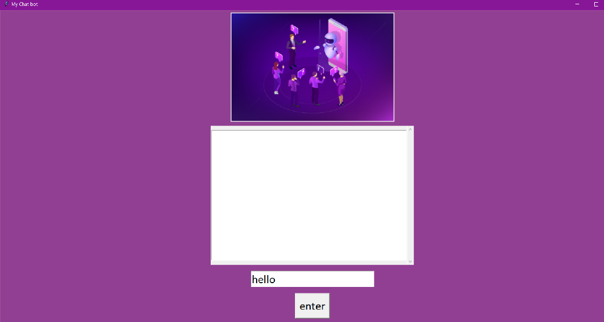

# Speech Recognition Chat Bot
Through chatbots one can communicate with a text or voice interface and get the reply. Typically, a chat bot will communicate with a real person. Chat bots are used in applications such as ecommerce customer service, call centres and Internet gaming. Chatbots are programs built to automatically engage with received messages.

# Overview
My project is a speech recognition chatbot with simple user interface. Chatbots are programs built to automatically engage with received messages. Here the chatbot is designed in such a way that it recognizes the speech and replies to it. The objective is it should recognize the speech clearly, and it should also reply correspondingly in text and audio. Chatbots are a class of intelligent, conversational systems that works by natural language input that can be in the form of text, voice, or both. They provide conversational output in response and are sometimes used for task execution. The Bot uses an offline backend corpus as a knowledge base. User initializing verbal input via a microphone. Then convert the answer into Voice output.

For user interface tkinter, pillow module is used. Tkinter contains font, messagebox, scroll-text, config, and many methods to create a good GUI. Pillow supports a wide variety of images such as “jpeg”, “png”, “bmp”, “gif”, “ppm”, “tiff”. The ImageTk module contains support to create and modify Tkinter BitmapImage and PhotoImage objects from PIL images. 

# Datasets
Here AmbiguityQA dataset is used. Ambiguity is inherent to open-domain question answering; especially when exploring new topics, it can be difficult to ask questions that have a single, unambiguous answer.
